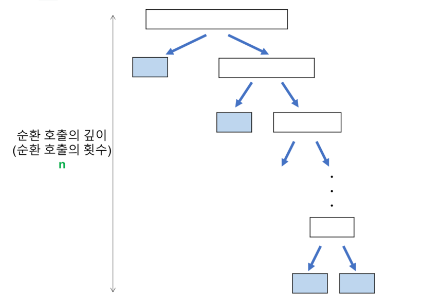

### 퀵 정렬(Quick Sort)

Quick Sort(퀵 정렬)은 <U>분할 정복 방법</U>을 통해 주어진 배열을 정렬한다.
```markdown
분할 정복 방법(Divide and Conquer)
- 문제를 작은 크기의 동일한 문제로 분할하고, 분할된 작은 문제를 해결한 후, 해결된 작은 문제의 답을 모아 원래 문제에 대한 답을 구하는 방법
```
  

## 퀵 정렬
- 최선의 경우(Best cases) : T(n) = O(nlog₂n)
  - 순환 호출의 깊이 * 각 순환 호출 단계의 비교 연산 = nlog₂n
      
  
    
- 최악의 경우(Worst cases) : T(n) = O(n²)  
    - 배열이 오름차순 정렬되어있거나 내림차순 정렬되어있는 경우
    - 순환 호출의 깊이 * 각 순환 호출 단계의 비교 연산 = n²
      

- 공간 복잡도 : O(n)

**장점**
1. 시간 복잡도가 O(nlog₂n)를 가지는 다른 정렬 알고리즘과 비교했을 때도 가장 빠르다.
2. 다른 메모리 공간을 필요로 하지 않는다.

**단점**
1. 불안정 정렬(Unstable Sort) 이다.
2. 정렬된 배열에 대해서는 오히려 수행시간이 오래 걸린다.

**예시**
- JAVA 에서 `Array.sort()` Dual Pivot Quick Sort 퀵 정렬로 구현되어 있다.


## 동작 과정
1. 배열 가운데서 하나의 원소를 고른다. 해당 원소를 **피벗(pivot)** 이라고 한다.
2. 피벗을 기준으로 피벗보다 작은 원소는 왼쪽, 큰 원소는 오른쪽으로 이동한다. = **분할 (Divide)**
3. 분할된 왼쪽과 오른쪽에서 재귀적으로 과정을 반복한다. = **정복 (Conquer)**


## 코드
- 정복 (Conquer)


```java
public void quickSort(int[] array, int start, int end) {
    if (start >= end) { // 원소가 1개인 경우
        return;
    }
        
    // 분할
    int pivot = partion(array, start, end);
    
    // 피벗은 제외한 2개의 부분 배열을 대상으로 순환 호출
    quickSort(array, start, pivot - 1); // 정복(Conquer)
    quickSort(array, pivot + 1, end); // 정복(Conquer)
}
```

- 분할 (Divide)

```java
public int partition(int[] array, int start, int end) {
    
    int pivot = array[(start + end) / 2];    
    while(start <= end) {
        while(array[start] < pivot) start++;
        while(array[end] > pivot) end--;
        if(start <= end) {
          swap(array, start, end);
          start++;
          end--;
        }
        swap(array, i, j);
    }
    
    return start;
}
```

```java
public void swap(int[] array, int start, int end) {
  int temp = array[start];
  array[start] = array[end];
  array[end] = temp;
}
```

### 에제
```markdown
   s                 e
// 3 9 4 7 5 0 1 6 8 2 [ pivot : 5 ]
// 3 2 4 1 0 5 7 6 8 9
```